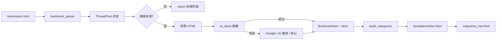

# 收藏夹变导航网页：把浏览器书签一键变成私人导航站

你是否遇到过这样的困境：收藏夹里堆了几百个链接，文件夹一层套一层，想找某个站点却要翻半天；导出成 HTML 备份后，打开仍是浏览器原生那种密密麻麻的列表，既不好看也不好用。本项目正是为解决这一问题而生——**读取 Chrome / Edge 等浏览器导出的 Netscape 格式书签，经过解析、校验、智能补全说明，最终生成一份可离线打开的现代化导航网页**。

本文从动机、架构、处理流水线、配置与使用方式等方面，全面介绍这个「书签 → 导航站」工具。

---

## 一、项目要解决什么问题

典型浏览器收藏夹具备这些特点：

- **体量大**：动辄数百条链接，人工维护成本高。
- **结构深**：`收藏夹栏/工作/设计素材` 等多级文件夹，导出后路径信息容易丢失或难以浏览。
- **信息贫**：多数书签只有标题和 URL，没有「这个站是干什么的」一句话说明。
- **死链多**：长期未访问的链接可能已失效，却仍占着位置。

本项目的核心目标可以概括为三点：

1. **保留文件夹分类**，在导航页顶部以 Tab 形式切换分类（取书签路径的最后一级文件夹名作为分类名）。
2. **自动剔除或过滤无效链接**（主入口 `app.py` 默认开启 HTTP 可达性检测）。
3. **为每个站点生成中文悬停说明**（优先本地大模型，辅以网页抓取、Google 摘要、AI 推测等多级兜底）。

生成结果是一份**单文件 HTML**（如 `output/my_nav.html`），双击即可在浏览器中打开，无需部署服务器，适合设为浏览器主页或放在 U 盘随身携带。

---

## 二、技术栈与项目结构

项目采用 **Python 标准库 + 静态 HTML 模板**，无重型框架依赖，结构清晰：

```
bookmarks/
├── bookmarks.html          # 用户放置：从浏览器导出的书签文件
├── app.py                  # 主程序（推荐）：含死链检测 + 本地 AI 摘要
├── bookmark_parser.py      # Netscape 书签解析器
├── ai_client.py            # 本地 Gemma/OpenAI 兼容 API 客户端
├── bookmark_nav_generator.py  # 备选 CLI：传统 meta 抓取 + Google API
├── config.json             # API 地址、并发、超时、提示词模板
├── templates/
│   └── index.html          # 深色主题导航页模板（含占位符 INSERT_DATA_HERE）
└── output/
    ├── my_nav.html         # 生成的导航页
    └── report.txt          # 处理报告（统计与每条说明来源）
```

| 模块 | 职责 |
|------|------|
| `bookmark_parser.py` | 解析 `<H3>` 文件夹、`<DL>` 层级、`<A>` 链接、`<DD>` 描述、Base64 图标 |
| `app.py` | 编排全流程：校验 → 抓取 → AI 摘要 → 分类 → 注入模板 |
| `ai_client.py` | 清洗 HTML 文本，调用本地 Chat Completions API 生成 15–30 字中文摘要 |
| `templates/index.html` | 前端 UI：分类导航、搜索、卡片网格、悬停 Tooltip |

---

## 三、书签从哪里来：Netscape 格式

Chrome、Edge、Firefox 等导出书签时，通常得到 `bookmarks.html`，其头部声明为：

```html
<!DOCTYPE NETSCAPE-Bookmark-file-1>
```

文件由嵌套的 `<DL><p>`、文件夹标题 `<H3>`、链接 `<A HREF="...">` 以及可选的 `<DD>` 描述组成。解析器使用状态栈跟踪文件夹路径，例如：

- 路径 `收藏夹栏/resourse` 下的链接，在导航页中归入分类 **「resourse」**（取路径最后一级）。
- 支持 `ICON` 属性（常为 Base64 小图标），生成页会优先使用；缺失时回退到 Google Favicon 服务。

`bookmark_parser.py` 还对编码做了兼容（UTF-8、GBK、GB18030），并对不规范的 `HREF` 引号做了容错。

---

## 四、核心处理流水线（`app.py`）

运行 `python app.py` 后，对每个书签条目按以下顺序处理（线程池并发，默认 4  worker）：

```
解析书签
    ↓
并发处理每个链接
    ├─ 1. validate_url：HEAD/GET 检测 http(s) 是否可达
    │      （403/401 在部分 CDN 场景下仍视为「存在」，避免误删）
    ├─ 2. 若书签自带 <DD> 描述 → 直接使用，标记 hover_source=bookmark
    ├─ 3. GET 抓取页面 HTML（最多 200KB）→ 清洗后送本地大模型摘要
    │      成功 → hover_source=local_gemma_server
    ├─ 4. 抓取 Google 搜索结果页尝试匹配摘要片段
    │      成功 → hover_source=google_snippet
    ├─ 5. 仅用「标题 + URL」构造提示词，请 AI 推测站点功能
    │      成功 → hover_source=ai_inference
    └─ 6. 兜底文案：「优质收藏站点：{标题}。点击即可访问。」
    ↓
build_categories：按文件夹末级名分组
    ↓
generate_html_pure：将 JSON 注入模板占位符 INSERT_DATA_HERE
    ↓
输出 output/my_nav.html 与 output/report.txt
```

这一设计的亮点在于 **说明文案的多级降级**：能抓页面就用真实内容；抓不到就借搜索或推理；最后仍有可读默认句，避免卡片悬停空白。

### 死链检测的策略

`validate_url` 先尝试 `HEAD`，不支持时回退 `GET`。对 405、403、401 等状态有特殊处理——许多站点禁止爬虫或未授权访问，但链接对人浏览器仍有效，因此 401/403 在二次 GET 失败时也可能被判定为**保留**。

---

## 五、本地大模型集成（`ai_client.py` + `config.json`）

摘要能力依赖 **OpenAI 兼容的本地推理服务**（默认 `http://127.0.0.1:8081/v1/chat/completions`，模型名 `gemma-4`）。

`config.json` 示例：

```json
{
  "api_url": "http://127.0.0.1:8081/v1/chat/completions",
  "max_workers": 4,
  "timeout_seconds": 8,
  "max_text_length": 4000,
  "prompt_template": "你是一个高效的书签导航助手。请根据下面给出的网页文本片段，用一句精炼的中文（15到35个字以内）总结这个网站的核心功能..."
}
```

`ai_client.py` 的主要逻辑：

1. **strip 脚本与样式**，压缩空白，截断至 `max_text_length`，避免撑爆上下文。
2. 使用 **system + one-shot 示例** 约束模型只输出一句中文摘要，减少「思考过程」废话。
3. 对返回内容做多轮正则清洗（去除 `<thought>`、多段落分析、英文长段等）。
4. 请求超时设为 `max(120, timeout_seconds * 10)`，并最多重试 2 次。

若未启动本地 API，第 3 步会失败，流程会自动落到 Google 片段、AI 推测或默认文案——**不强制依赖 GPU**，但摘要质量会下降。

---

## 六、生成的导航页长什么样

模板 `templates/index.html` 提供：

- **深色 Slate 风格**：`#0f172a` 背景、卡片悬停上浮与描边高亮。
- **顶部分类 Tab**：与书签文件夹一一对应，点击切换。
- **圆角搜索框**：在当前分类内按标题过滤（实时 `render`）。
- **卡片网格**：图标 + 标题，点击 `window.open` 新标签打开。
- **悬停 Tooltip**：显示 `hover` 字段（即处理阶段写入的中文说明），并做视口边界避让。

数据通过模板中的占位符注入：

```html
<script id="data" type="application/json">
INSERT_DATA_HERE
</script>
```

`generate_html_pure` 用 `json.dumps` 替换 `INSERT_DATA_HERE`，**整页样式与脚本保持完整**，避免早期「正则抠 `<style>`」导致页面样式丢失的问题。

---

## 七、处理报告 `report.txt`

每次运行会生成统计与明细，便于复盘与调参。示例：

```
总计书签: 442
有效留存: 390
死链剔除: 52
耗时: 2288.15s

[精选留存数据]
- [收藏夹栏/resourse] 果汁实验室 | http://guozhivip.com/lab/ | (local_gemma_server) 果汁实验室是一个综合性导航站...
```

其中 `hover_source` 字段标明说明来源，常见取值：

| 来源标记 | 含义 |
|----------|------|
| `bookmark` | 导出文件中自带的 `<DD>` 描述 |
| `local_gemma_server` | 抓取页面后由本地模型摘要 |
| `google_snippet` | 从 Google 搜索结果 HTML 提取片段 |
| `ai_inference` | 仅凭标题与 URL 的 AI 推测 |
| `default_text` | 固定兜底句式 |

---

## 八、备选入口：`bookmark_nav_generator.py`

除 `app.py` 外，仓库还提供 **命令行版生成器**，适合不想跑本地大模型、或希望对接 **Google Custom Search API** 的场景：

```bash
python bookmark_nav_generator.py \
  --bookmarks bookmarks.html \
  --template templates/index.html \
  --output-html output/custom.html \
  --validate-links \
  --google-api-key YOUR_KEY \
  --google-cx YOUR_CX
```

该脚本特点：

- 使用 `fetch_hover_text` 从页面 `<title>` / `meta description` 提取说明。
- 可选 `translate_to_zh` 将英文简介译为中文（Google Translate 非官方接口）。
- 检测 Cloudflare 挑战页并跳过无效摘要。
- 通过 `generate_html` 将样式嵌入新生成的 HTML（与 `app.py` 的占位符注入方式不同）。

两条路径可并存：日常推荐 **`app.py` + 本地模型`** 以获得更贴切的中文说明；轻量环境可用 CLI 版。

---

## 九、快速上手

### 1. 导出书签

在 Chrome / Edge 中：`书签管理器` → `⋮` → **导出书签**，得到 `bookmarks.html`，复制到项目根目录（覆盖或替换现有文件）。

### 2. 配置（可选）

编辑 `config.json`：

- `api_url`：本地 LLM 服务地址。
- `max_workers`：并发数（过大可能触发目标站限流）。
- `timeout_seconds`：单次 HTTP 超时（秒）。

### 3. 启动本地模型（推荐）

确保本机已有兼容 OpenAI Chat Completions 的服务（如 LM Studio、llama.cpp server、vLLM 等），监听地址与 `config.json` 一致。

### 4. 运行

```bash
python app.py
```

### 5. 打开成果

用浏览器打开 `output/my_nav.html`。可将该文件路径设为**主页**，或同步到 NAS / 静态托管（GitHub Pages 等）供多设备访问。

---

## 十、架构示意



---

## 十一、性能与使用建议

- **耗时**：数百书签 + 逐站抓取 + 本地推理，总耗时可达数十分钟甚至更久（与网络、模型速度、并发数相关）。可先缩小书签子集试跑。
- **并发**：`max_workers` 过高可能被目标站封 IP；过低则速度慢，建议在 4–8 之间权衡。
- **隐私**：处理过程会对外发起 HTTP 请求；若书签含内网或敏感 URL，请在隔离环境运行。
- **SSL**：`app.py` 中为提高抓取成功率对 HTTPS 校验做了放宽（`CERT_NONE`），仅建议在受控环境使用。
- **Google 抓取**：`fetch_google_snippet` 依赖 HTML 结构，Google 改版后可能失效，届时更依赖本地模型或 `ai_inference` 分支。

---

## 十二、适用场景与延伸

| 场景 | 做法 |
|------|------|
| 个人浏览器主页 | 定期导出书签 → 运行 `app.py` → 覆盖 `my_nav.html` |
| 团队资源导航 | 统一维护一份 `bookmarks.html`，生成静态页部署到内网 |
| 素材 / 工具合集 | 利用原有文件夹分类，生成带搜索的专题导航 |
| 清理死链 | 查看 `report.txt` 中被剔除的 URL，回浏览器删除后重新导出 |

你还可以自行修改 `templates/index.html` 中的标题「我的导航」、配色 CSS 变量（`:root`），或增加暗色/浅色切换，而无需改动 Python 逻辑——只要保留 `INSERT_DATA_HERE` 占位符即可。

---

## 十三、小结

**收藏夹变导航网页** 不是简单的「HTML 美化器」，而是一条完整的书签治理流水线：解析 Netscape 结构、并发校验与 enrich、本地大模型生成中文摘要、按文件夹自动分类，最后输出可离线使用的单页导航。

如果你厌倦了在浏览器收藏夹里「考古」，不妨把导出文件丢进项目根目录，配好本地 API，运行一次 `python app.py`——几分钟后，你或许会更愿意把 `output/my_nav.html` 当作每天打开浏览器的第一个页面。

---

*文档根据当前仓库代码整理，主入口为 `app.py`，模板为 `templates/index.html`。*
